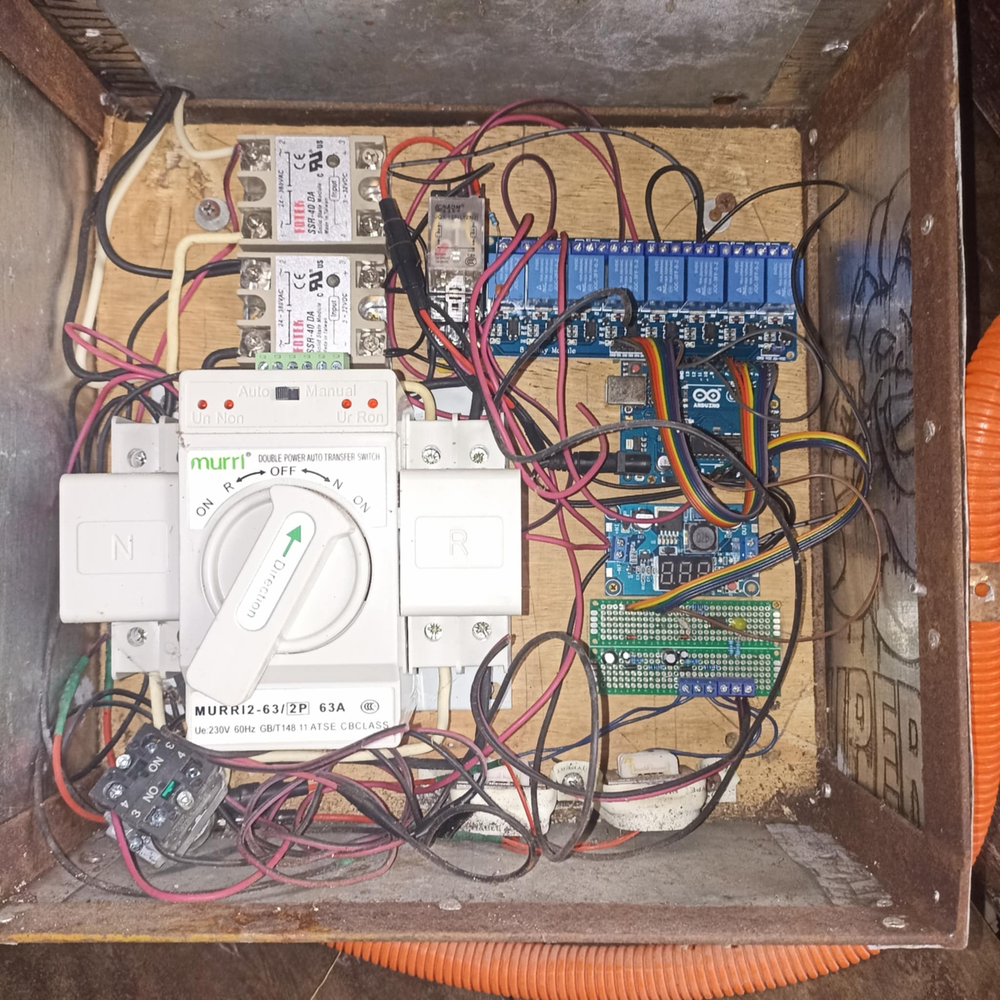

# HADES - Hybrid ATS and Detection Engine System

A microcontroller-based system designed for household backup power applications. It continuously monitors mains voltage and automatically controls a generator during power outages. The system integrates an automatic transfer switch (ATS) mechanism to ensure a seamless transfer of the electrical load between mains and generator power.  

---

## Overview

Power outages can disrupt household operations and damage sensitive equipment. Hades provides an automated solution that:  
- Detects power failures.  
- Initiates a generator start sequence.  
- Transfers load safely to generator output.  
- Returns to mains power when available.  

The system is built using discrete components and a microcontroller (Arduino), prioritizing reliability and electrical isolation.  

---

## Features

- **Mains and Generator Voltage Monitoring**  
  Step-down transformers with filtering provide accurate voltage readings and galvanic isolation.  

- **Automatic Generator Start/Stop**  
  Includes a controlled cranking sequence and shutdown logic.  

- **Oil Level Protection**  
  Continuously checks the oil level to prevent generator damage.  

- **Automatic Load Transfer (ATS)**  
  Controls solid-state relays (SSR) to transfer Line and Neutral connections between mains and generator.  

- **Self-Power Management**  
  Powered from the generator's 12V battery with a 5V regulator. Includes a hold relay to power down the MCU when mains power is restored.  

---

## System Workflow

1. Monitor mains voltage continuously.  
2. When voltage falls below the configured threshold:
   - Initiate generator cranking.  
   - Wait until generator voltage stabilizes (215–240V).  
3. Transfer the load from mains to generator using SSRs and the ATS.  
4. When mains power is restored:
   - Transfer load back to mains.  
   - Shut down the generator and power down the MCU.  

---

## Hardware Overview

### Panel Image

### Pinout Reference

#### Digital Outputs

| Pin | Signal Name                       | Description                              |
|-----|------------------------------------|------------------------------------------|
| D9  | `DO_Generator_Crank_P9_K1`         | Crank relay (initiates generator start)  |
| D8  | `DO_Generator_Start_P8_K2`         | Start relay (maintains generator run)    |
| D7  | `DO_OilLamp_Indicator_P7_K3`       | Oil level warning lamp                   |
| D6  | `DO_ArdSup_HoldContact_P6_K4`      | MCU hold relay (self-power management)   |
| D5  | `DO_GeneratorLine1_Contact_P5_K5`  | Generator Line 1 output relay            |
| D4  | `DO_GeneratorLine2_Contact_P4_K6`  | Generator Line 2 output relay            |
| D3* | `DO_MainsLine1_Contact_P3_K7`      | Mains Line 1 output relay (not used)     |
| D2* | `DO_MainsLine2_Contact_P2_K8`      | Mains Line 2 output relay (not used)     |

\*Currently commented out in the code.

#### Digital Inputs

| Pin | Signal Name                 | Description                    |
|-----|------------------------------|--------------------------------|
| A3  | `DI_Oil_LowLevelContact`     | Oil low-level switch input     |

#### Analog Inputs

| Pin | Signal Name                              | Description                              |
|-----|-------------------------------------------|------------------------------------------|
| A0  | `AI_Generator_VoltageLevelSensor_PA0`     | Generator voltage measurement (isolated) |
| A1  | `AI_Mains_VoltageLevelSensor_PA1`         | Mains voltage measurement (isolated)     |

---

## Installation

1. **Hardware Preparation**  
   - Connect transformers, SSRs, relays, and sensors based on the pinout table.  
   - Ensure proper isolation for all mains connections.  

2. **Upload the Firmware**  
   - Open `src/hades.ino` in the Arduino IDE.  
   - Select the correct board and COM port.  
   - Upload the firmware to the microcontroller.  

3. **Test and Calibrate**  
   - Verify voltage readings.  
   - Simulate a mains power loss to confirm generator start and transfer sequence.  

---

## Safety Notes

- This system operates at **mains voltage (220–240V)**. Incorrect installation or handling can result in serious injury or death.  
- Ensure all high-voltage wiring is performed by a qualified electrician.  
- Improper generator handling (especially during cranking) can damage the generator or cause personal injury.  

---

## Future Improvements

- Add configurable thresholds via user interface.  
- Support for three-phase systems.  
- Integrated logging and diagnostic features.  

---
